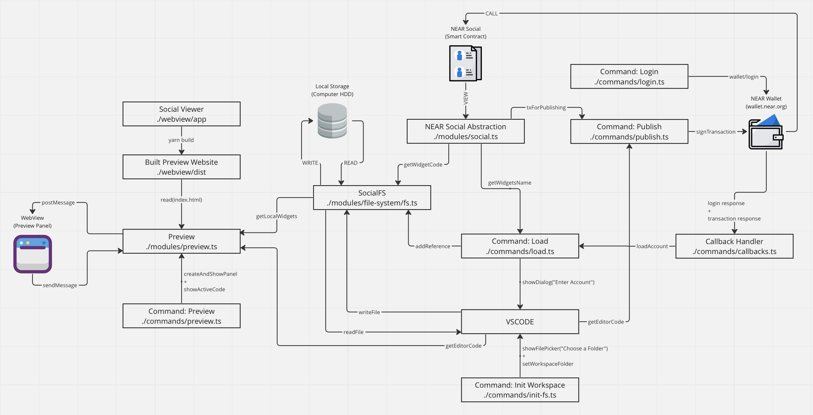

# Extension Design

We have created this file to help navigate the extension's code for those that want to contribute. VSCODE extensions are compose by multiple files, some defining UI, some defining logic. While we have made our best to use clear code patterns, it is understandable if a newcomer has a hard time navigating all the moving parts of this project (specially one not familiarized with writing vscode extension). 

We hope this file helps you find your way in helping us, and please feel free to contribute in any way to this particular guidelines, or any aspect of the project.

---

## Overview

The Discovery VSCODE extension is composed by 4 main actors, 5 commands and 1 callback handler.



#### Components
- `vscode` itself, composed by an editor, panels, and a UI.
- `socialdb`, the contract deployed at `social.near` storing widgets.
- A `local folder`, were the extension saves local work.
- A `webview`, a panel were the widget's code can be previewed.

#### Commands
- `initFs`: Asks the user to select a folder in their computer to use as local storage.
- `Load`: Given an `accountId`, populates the workspace with the account's widgets.
- `Login`: Redirects the user's to the NEAR Wallet to retrieve their username (no key is created).
- `Preview`: Renders the local code of the widget in the `webview`. 
- `Publish`: Takes the editor code and creates a transaction to call the `set` method in `social.near`  

#### Callback Handler
The commands `Login` and `Publish` open the web browser to interact with the NEAR wallet. After the interaction is done, the NEAR wallet calls back the vscode extension. The callback handler takes the response and acts upon it.

---

## General Knowledge

Writing an extension involves learning how `vscode` components are created and communicate with each other. Lets first review some general knowledge necessary to understand this extension.  

### Buttons to Commands
`vscode` makes you define the UI of your extension in the root's `package.json`. For example, this is how we configure a `Choose your folder` button on the welcome view, that triggers the `near.chooseLocalPath` command:

```json
{
  "contributes": {
    "commands": [
      {
        "command": "near.chooseLocalPath",
        "title": "Choose Widget Folder",
        "category": "NEAR.discovery"
      },
    ],
    "viewsWelcome": [
      {
        "view": "near-discovery",
        "contents": "[Choose your working folder](command:near.chooseLocalPath)",
        "when": "resourceScheme != near"
      },
    ]
  }
}
```

Then, in `./src/extension.ts` we register what happens when such command is triggered:

```js
  import { chooseLocalPath } from "./commands/init-fs";

  export function activate(context: vscode.ExtensionContext) {
    // ...
    context.subscriptions.push(
      vscode.commands.registerCommand("near.chooseLocalPath", async () => {
      chooseLocalPath(context, socialFS);
    })
    // ...
  );
```

---

## Our Filesystem

`vscode` allows you to create a customized `FileSystemProvider`, which basically serves to define:
- How a file should be read from the filesystem.
- How to write a file to the filesystem.
- How the files are organized.

In this extension, we deal solely with the problem of creating widgets, which could be found either locally (in the HDD) or remote (stored at social.near). Because of this, we decided to implement the filesystem in the following way.

#### Filesystem Structure
All files have an `uri` with the form: `near:://accountId/widgetName`. The files have a flag which indicates if the files are stored locally or remotely.

#### Start the Filesystem
When the user selects executes the [`initFs`](#init-fs) command, choosing a local folder, we first check if the folder has any widget and load it. We assume that the folders represent an `accountId` and the widgets are stored as `.jsx` files.

We then populate our FS, marking all the files as local. Notice that we do not read the files, since it is not necessary.

#### Load an AccountId
When an accountId is loaded through the [`load command`](#openaccountwidgets), we simply query `near.social` asking for the user's widgets, create a folder in our filesystem for the `accountId`, and create files for each `widgetName` marking them as `remote`.

Notice we fetch **only the widget names**, and not their content, since it is not necessary.

#### Read Files
If the file is present locally, we load its content from the HDD. If the file is remote, we make a `view` call to `near.social` to read its content.

#### Write Files
We take the content from the editor and write it locally. We mark the file as local in our FS. (TODO: Delete the file once it is published).

---

## Extension Commands

Here we provide a high level explanation of how each command works.

### Init-FS
The first thing a user needs to do is press the `Choose a folder` button in the Welcome Page. This will in turn execute `chooseLocalPath`, which will prompt the user to select a local folder in their computer.

Once the user selected a folder, the extension will store it in the `localStoragePath` variable, available globally across the extension. Then, we overwrite the `vscode.workspaceFolder`, setting it to our filesystem's root. This way, any interaction with the editor will invoke our filesystem.

**VERY Important**: Since this command changes the root `workspaceFolder`, when the user runs this command `vscode` resets. This is done automatically by `vscode`, since it needs to propagate the new root to all extensions.

---

## Preview
`vscode` enables to use a `webview` panel, in which web-applications can be displayed. Furthermore, `vscode` exposes methods to exchange messages with such `webview`.

In this extension, the web-app we use can be found in `./webview/app`, and it is a modified version of the [`Social Viewer`](https://github.com/NearSocial/viewer/tree/master). 

Before using it, you need to enter in `./webview/app` and run `yarn && yarn build`, this will in turn create the `./webview/dist` folder, which is a compiled React Application, that the `vscode.webview` can directly load.