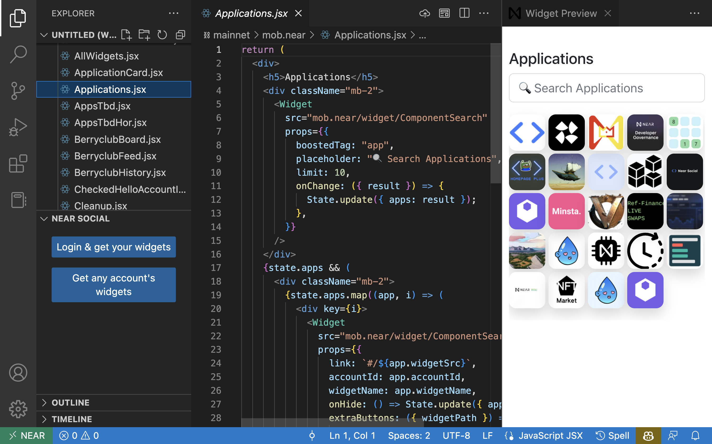
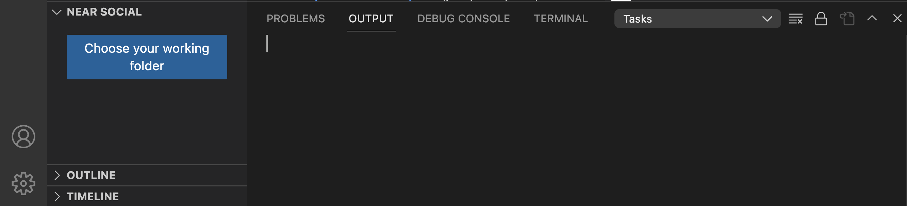

# NEAR VSCode extension

Extension to help you develop [components](https://discovery.near-docs.io) in [NEAR Discovery](https://alpha.near.org).

## Features
- Retrieve any widget from Discovery
- Change the code and preview the changes locally
- Publish directly to Social

## How to Use
After installing the widget, a new section named "NEAR SOCIAL" will be added to the editor explorer.

### Start Your Workspace

Choose a working directory using the `Choose your working folder` button.

### Retrieve Widgets, Preview and Publish

Use the `Login & Get Widgets` to login into your NEAR account and fetch your widgets, or use the `Get Account Widgets` the widgets of any account in NEAR Social.

Use the explorer to open any file, and the `preview` button to preview your changes.

> The preview is not automatically reloaded, you will need to press the `preview` button again.

Use the `publish` buttons to store the widget in Discovery.