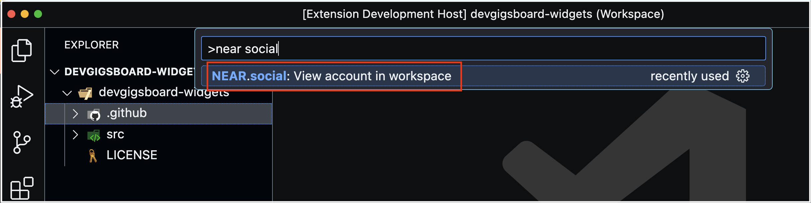
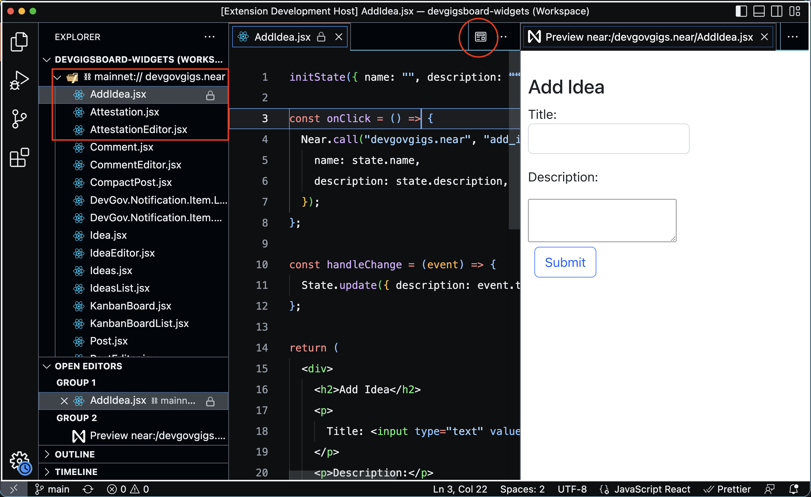

# NEAR VSCode extension

This is a viewer for Widgets deployed on NEAR Social DB.

- You can add an account to your workspace as a folder.

- You can preview Widgets in a side-panel

## Testing it:

1. Clone this repository into a local folder
2. Open the folder with VSCODE
3. Run `yarn` or `npm install`
4. Press F5 while in VSCODE
5. Interact with the `NEAR SOCIAL` panel of the explorer
